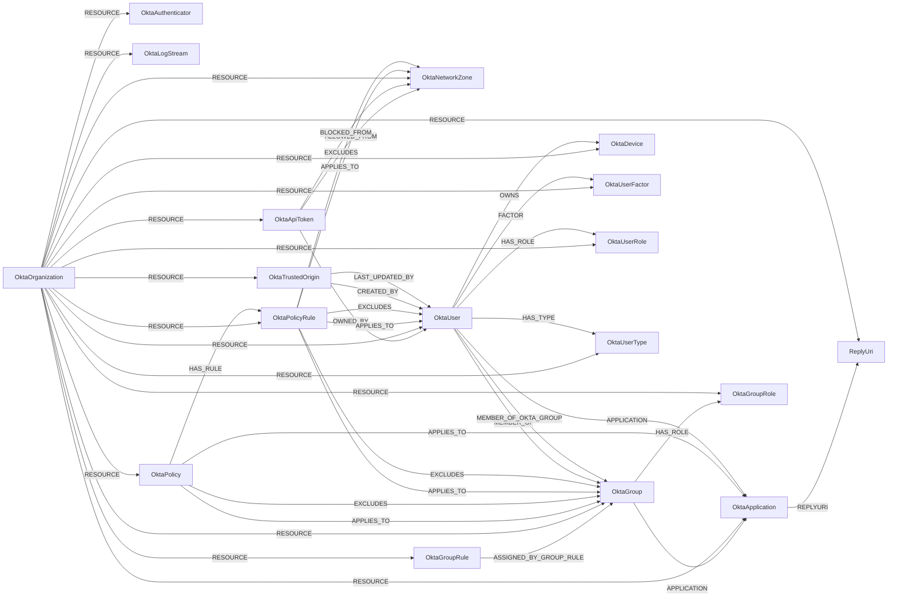

<!-- Generated from the data model. Do not edit manually. -->

## Okta Schema

### OktaApiToken

An Okta API token (SSWS token). Its secret is never returned by the API.
Requires the `okta.apiTokens.read` scope.

> **Ontology Mapping**: This node uses the ontology label [`APIKey`](#ontology-apikey).

#### Properties

Ontology-generated fields are shown in *italics*.

| Field | Index | Description |
|-------|-------|-------------|
| id | Yes | Unique Okta API token identifier. |
| firstseen |  | Timestamp when a sync job first created this node. |
| lastupdated | Yes | Timestamp of the last sync that observed this resource. |
| client_name |  | Client that created the token, such as `Okta API` for Admin Console tokens. |
| created |  | Time when the token was created. |
| expires_at |  | Time when the token expires if it is not used again. Okta extends it by `token_window` each time the token is used, so it is the last use plus `token_window`; Okta does not expose the last-use time directly. |
| name |  | Token name. |
| network_connection |  | Network condition on token use: `ANYWHERE`, or `ZONE` when the token is only accepted from (or outside) specific network zones. |
| okta_last_updated |  | Time when Okta last updated the token. |
| token_window |  | ISO 8601 duration of inactivity after which the token expires, such as `P30D`. |
| user_id |  | ID of the Okta user who owns the token. The token acts with that user's admin roles. |
| *_ont_created_at* | Yes | Normalized field sourced from `created`. |
| *_ont_expires_at* | Yes | Normalized field sourced from `expires_at`. |
| *_ont_name* | Yes | Normalized field sourced from `name`. |
| *_ont_source* |  | Module that populated this node's ontology fields. |

#### Relationships

- `(:OktaApiToken)-[:ALLOWED_FROM]->(:OktaNetworkZone)`: An Okta API token can only be used from a network zone.

- `(:OktaApiToken)-[:BLOCKED_FROM]->(:OktaNetworkZone)`: An Okta API token cannot be used from a network zone.

- `(:OktaApiToken)-[:OWNED_BY]->(:OktaUser)`: An Okta API token is owned by, and acts as, an Okta user.

- `(:User)-[:OWNS]->(:OktaApiToken)`: generated by analysis job `Ontology - User OWNS APIKey linking`.

- `(:OktaOrganization)-[:RESOURCE]->(:OktaApiToken)`: An Okta organization contains an API token.

### OktaApplication

> **Ontology Mapping**: This node uses the ontology label [`ThirdPartyApp`](#ontology-thirdpartyapp).

#### Properties

Ontology-generated fields are shown in *italics*.

| Field | Index | Description |
|-------|-------|-------------|
| id | Yes | Unique identifier for the Okta resource. |
| firstseen |  | Timestamp when a sync job first created this node. |
| lastupdated | Yes | Timestamp of the last sync that observed this resource. |
| accessibility_error_redirect_url |  | Okta accessibility error redirect URL. |
| accessibility_login_redirect_url |  | Okta accessibility login redirect URL. |
| accessibility_self_service |  | Okta accessibility self service. |
| activated |  | Okta activated. |
| created |  | Okta created. |
| credentials_signing_kid |  | Okta credentials signing kid. |
| credentials_signing_last_rotated |  | Okta credentials signing last rotated. |
| credentials_signing_next_rotation |  | Okta credentials signing next rotation. |
| credentials_signing_rotation_mode |  | Okta credentials signing rotation mode. |
| credentials_signing_use |  | Okta credentials signing use. |
| credentials_user_name_template_push_status |  | Okta credentials user name template push status. |
| credentials_user_name_template_suffix |  | Okta credentials user name template suffix. |
| credentials_user_name_template_template |  | Okta credentials user name template template. |
| credentials_user_name_template_type |  | Okta credentials user name template type. |
| features |  | Okta features. |
| label |  | Okta label. |
| last_updated |  | Okta last updated. |
| licensing_seat_count |  | Okta licensing seat count. |
| name |  | Okta name. |
| settings_app_acs_url |  | Okta settings app ACS URL. |
| settings_app_button_field |  | Okta settings app button field. |
| settings_app_implicit_assignment |  | Okta settings app implicit assignment. |
| settings_app_inline_hook_id |  | Okta settings app inline hook ID. |
| settings_app_login_url_regex |  | Okta settings app login URL regex. |
| settings_app_org_name |  | Okta settings app org name. |
| settings_app_password_field |  | Okta settings app password field. |
| settings_app_url |  | Okta settings app URL. |
| settings_app_username_field |  | Okta settings app username field. |
| settings_notes_admin |  | Okta settings notes admin. |
| settings_notes_enduser |  | Okta settings notes enduser. |
| settings_notifications_vpn_help_url |  | Okta settings notifications VPN help URL. |
| settings_notifications_vpn_message |  | Okta settings notifications VPN message. |
| settings_notifications_vpn_network_connection |  | Okta settings notifications VPN network connection. |
| settings_notifications_vpn_network_exclude |  | Okta settings notifications VPN network exclude. |
| settings_notifications_vpn_network_include |  | Okta settings notifications VPN network include. |
| settings_oauth_client_application_type |  | Okta settings OAuth client application type. |
| settings_oauth_client_client_uri |  | Okta settings OAuth client client URI. |
| settings_oauth_client_consent_method |  | Okta settings OAuth client consent method. |
| settings_oauth_client_grant_Type |  | Okta settings OAuth client grant type. |
| settings_oauth_client_idp_initiated_login_default_scope |  | Okta settings OAuth client IdP initiated login default scope. |
| settings_oauth_client_idp_initiated_login_mode |  | Okta settings OAuth client IdP initiated login mode. |
| settings_oauth_client_initiate_login_uri |  | Okta settings OAuth client initiate login URI. |
| settings_oauth_client_logo_uri |  | Okta settings OAuth client logo URI. |
| settings_oauth_client_policy_uri |  | Okta settings OAuth client policy URI. |
| settings_oauth_client_post_logout_redirect_uris |  | Okta settings OAuth client post logout redirect uris. |
| settings_oauth_client_redirect_uris |  | Okta settings OAuth client redirect uris. |
| settings_oauth_client_response_types |  | Okta settings OAuth client response types. |
| settings_oauth_client_tos_uri |  | Okta settings OAuth client tos URI. |
| settings_oauth_client_wildcard_redirect |  | Okta settings OAuth client wildcard redirect. |
| settings_sign_on_assertion_signed |  | Okta settings sign on assertion signed. |
| settings_sign_on_audience |  | Okta settings sign on audience. |
| settings_sign_on_audience_override |  | Okta settings sign on audience override. |
| settings_sign_on_authn_context_class_ref |  | Okta settings sign on authn context class ref. |
| settings_sign_on_default_relay_state |  | Okta settings sign on default relay state. |
| settings_sign_on_destination |  | Okta settings sign on destination. |
| settings_sign_on_destination_override |  | Okta settings sign on destination override. |
| settings_sign_on_digest_algorithm |  | Okta settings sign on digest algorithm. |
| settings_sign_on_honor_force_authn |  | Okta settings sign on honor force authn. |
| settings_sign_on_idp_issuer |  | Okta settings sign on IdP issuer. |
| settings_sign_on_recipient |  | Okta settings sign on recipient. |
| settings_sign_on_recipient_override |  | Okta settings sign on recipient override. |
| settings_sign_on_response_signed |  | Okta settings sign on response signed. |
| settings_sign_on_signature_algorithm |  | Okta settings sign on signature algorithm. |
| settings_sign_on_sso_acs_url |  | Okta settings sign on SSO ACS URL. |
| settings_sign_on_sso_acs_url_override |  | Okta settings sign on SSO ACS URL override. |
| settings_sign_on_subject_name_id_format |  | Okta settings sign on subject name ID format. |
| settings_sign_on_subject_name_id_template |  | Okta settings sign on subject name ID template. |
| sign_on_mode |  | Okta sign on mode. |
| status |  | Okta status. |
| visibility_app_links |  | Okta visibility app links. |
| visibility_auto_launch |  | Okta visibility auto launch. |
| visibility_auto_submit_toolbar |  | Okta visibility auto submit toolbar. |
| visibility_hide |  | Okta visibility hide. |
| *_ont_client_id* | Yes | Normalized field sourced from `id`. |
| *_ont_enabled* | Yes | Normalized field sourced from `status`. |
| *_ont_name* | Yes | Normalized field sourced from `label`. |
| *_ont_protocol* | Yes | Normalized field sourced from `sign_on_mode`. |
| *_ont_source* |  | Module that populated this node's ontology fields. |

#### Relationships

- `(:OktaGroup)-[:APPLICATION]->(:OktaApplication)`

- `(:OktaUser)-[:APPLICATION]->(:OktaApplication)`

- `(:OktaPolicy)-[:APPLIES_TO]->(:OktaApplication)`: An Okta authentication policy governs sign-in to an application.

- `(:User)-[:AUTHORIZED]->(:OktaApplication)`: generated by analysis job `Ontology - User AUTHORIZED ThirdPartyApp linking`.
  - Properties:

    | Field | Description |
    |-------|-------------|
    | scopes | Property generated by analysis job: `Ontology - User AUTHORIZED ThirdPartyApp linking`. |

- `(:OktaApplication)-[:REPLYURI]->(:ReplyUri)`

- `(:OktaOrganization)-[:RESOURCE]->(:OktaApplication)`

### OktaAuthenticator

#### Properties

| Field | Index | Description |
|-------|-------|-------------|
| id | Yes | Unique identifier for the Okta resource. |
| firstseen |  | Timestamp when a sync job first created this node. |
| lastupdated | Yes | Timestamp of the last sync that observed this resource. |
| authenticator_type |  | Okta authenticator type. |
| created |  | Okta created. |
| key |  | Okta key. |
| last_updated |  | Okta last updated. |
| name |  | Okta name. |
| provider_auth_port |  | Okta provider auth port. |
| provider_configuration |  | Okta provider configuration. |
| provider_host_name |  | Okta provider host name. |
| provider_instance_id |  | Okta provider instance ID. |
| provider_integration_key |  | Okta provider integration key. |
| provider_type |  | Okta provider type. |
| provider_user_name_template |  | Okta provider user name template. |
| settings |  | Okta settings. |
| settings_allowed_for |  | Okta settings allowed for. |
| settings_app_instance_id |  | Okta settings app instance ID. |
| settings_channel_binding |  | Okta settings channel binding. |
| settings_compliance |  | Okta settings compliance. |
| settings_token_lifetime_minutes |  | Okta settings token lifetime minutes. |
| settings_user_verification |  | Okta settings user verification. |
| status |  | Okta status. |

#### Relationships

- `(:OktaOrganization)-[:RESOURCE]->(:OktaAuthenticator)`

### OktaDevice

A device registered or managed in Okta.

> **Ontology Projection**: `OktaDevice` contributes data to canonical [`Device`](#ontology-device) nodes.

#### Properties

| Field | Index | Description |
|-------|-------|-------------|
| id | Yes | Unique Okta device identifier. |
| firstseen |  | Timestamp when a sync job first created this node. |
| lastupdated | Yes | Timestamp of the last sync that observed this node. |
| created |  | Device creation time. |
| disk_encryption_type |  | Device disk encryption type. |
| display_name | Yes | User-facing device name. |
| imei |  | Device IMEI. |
| integrity_jailbreak |  | Whether the device is jailbroken or rooted. |
| managed |  | Whether the device is managed by MDM software. |
| manufacturer |  | Device manufacturer. |
| meid |  | Device MEID. |
| model |  | Device model. |
| okta_last_updated |  | Time when Okta last updated the device. |
| os_version |  | Device operating system version. |
| platform |  | Device platform reported by Okta. |
| registered |  | Whether the device is registered in Okta. |
| resource_alternate_id |  | Alternate identifier for the Okta resource. |
| resource_display_name |  | Display name from the Okta resource metadata. |
| resource_display_name_sensitive |  | Whether the resource display name contains sensitive data. |
| resource_type |  | Okta resource type. |
| secure_hardware_present |  | Whether secure hardware is present. |
| serial_number | Yes | Device serial number. |
| sid |  | Windows security identifier. |
| status |  | Device lifecycle status. |
| tpm_public_key_hash |  | Windows TPM public key hash. |
| udid |  | Device UDID. |

#### Relationships

- `(:Device)-[:OBSERVED_AS]->(:OktaDevice)`

- `(:OktaUser)-[:OWNS]->(:OktaDevice)`: An Okta user owns a registered device.
  - Properties:

    | Field | Description |
    |-------|-------------|
    | enrolled_at | Time when the user enrolled the device. |
    | management_status | Device management status for this user enrollment. |
    | screen_lock_type | Screen lock type reported for this user enrollment. |

- `(:OktaOrganization)-[:RESOURCE]->(:OktaDevice)`: An Okta organization contains a registered device.

### OktaGroup

> **Ontology Mapping**: This node uses the ontology label [`UserGroup`](#ontology-usergroup).

#### Properties

Ontology-generated fields are shown in *italics*.

| Field | Index | Description |
|-------|-------|-------------|
| id | Yes | Unique identifier for the Okta resource. |
| firstseen |  | Timestamp when a sync job first created this node. |
| lastupdated | Yes | Timestamp of the last sync that observed this resource. |
| created |  | Okta created. |
| description |  | Okta description. |
| dn |  | Okta dn. |
| external_id |  | Okta external ID. |
| group_type |  | Okta group type. |
| last_membership_updated |  | Okta last membership updated. |
| last_updated |  | Okta last updated. |
| name | Yes | Okta name. |
| object_class |  | Okta object class. |
| sam_account_name |  | Okta sam account name. |
| windows_domain_qualified_name |  | Okta windows domain qualified name. |
| *_ont_description* |  | Normalized field sourced from `description`. |
| *_ont_name* | Yes | Normalized field sourced from `name`. |
| *_ont_source* |  | Module that populated this node's ontology fields. |

#### Relationships

- `(:OktaGroup)-[:APPLICATION]->(:OktaApplication)`

- `(:OktaPolicy)-[:APPLIES_TO]->(:OktaGroup)`: An Okta policy applies to the members of a group.

- `(:OktaPolicyRule)-[:APPLIES_TO]->(:OktaGroup)`: An Okta policy rule applies to the members of a group.

- `(:OktaGroupRule)-[:ASSIGNED_BY_GROUP_RULE]->(:OktaGroup)`

- `(:OktaPolicy)-[:EXCLUDES]->(:OktaGroup)`: An Okta policy excludes the members of a group.

- `(:OktaPolicyRule)-[:EXCLUDES]->(:OktaGroup)`: An Okta policy rule excludes the members of a group.

- `(:OktaGroup)-[:HAS_ROLE]->(:OktaGroupRole)`

- `(:OktaGroup)-[:MEMBER_OF]->(:KubernetesGroup)`: Links an Okta group to the Kubernetes group its members join.

- `(:OktaUser)-[:MEMBER_OF]->(:OktaGroup)`

- `(:OktaUser)-[:MEMBER_OF_OKTA_GROUP]->(:OktaGroup)`

- `(:OktaOrganization)-[:RESOURCE]->(:OktaGroup)`

### OktaGroupRole

> **Ontology Mapping**: This node uses the ontology label [`PermissionRole`](#ontology-permissionrole).

#### Properties

Ontology-generated fields are shown in *italics*.

| Field | Index | Description |
|-------|-------|-------------|
| id | Yes | Unique identifier for the Okta resource. |
| firstseen |  | Timestamp when a sync job first created this node. |
| lastupdated | Yes | Timestamp of the last sync that observed this resource. |
| assignment_type |  | Okta assignment type. |
| created |  | Okta created. |
| description |  | Okta description. |
| label |  | Okta label. |
| last_updated |  | Okta last updated. |
| name |  | Okta name. |
| role_type |  | Okta role type. |
| status |  | Okta status. |
| *_ont_name* | Yes | Normalized field sourced from `label`. |
| *_ont_scope* | Yes | Property generated by the ontology mapping. |
| *_ont_source* |  | Module that populated this node's ontology fields. |
| *_ont_type* | Yes | Property generated by the ontology mapping. |

#### Relationships

- `(:OktaGroup)-[:HAS_ROLE]->(:OktaGroupRole)`

- `(:OktaOrganization)-[:RESOURCE]->(:OktaGroupRole)`

### OktaGroupRule

#### Properties

| Field | Index | Description |
|-------|-------|-------------|
| id | Yes | Unique identifier for the Okta resource. |
| firstseen |  | Timestamp when a sync job first created this node. |
| lastupdated | Yes | Timestamp of the last sync that observed this resource. |
| assigned_groups |  | Okta assigned groups. |
| condition_type |  | Okta condition type. |
| conditions |  | Okta conditions. |
| created |  | Okta created. |
| exclusions |  | Okta exclusions. |
| expression_type |  | Okta expression type. |
| inclusions |  | Okta inclusions. |
| last_updated |  | Okta last updated. |
| name |  | Okta name. |
| status |  | Okta status. |

#### Relationships

- `(:OktaGroupRule)-[:ASSIGNED_BY_GROUP_RULE]->(:OktaGroup)`

- `(:OktaOrganization)-[:RESOURCE]->(:OktaGroupRule)`

### OktaLogStream

An Okta log stream that forwards System Log events to an external
destination such as AWS EventBridge or Splunk Cloud. Requires the
`okta.logStreams.read` scope.

#### Properties

| Field | Index | Description |
|-------|-------|-------------|
| id | Yes | Unique Okta log stream identifier. |
| firstseen |  | Timestamp when a sync job first created this node. |
| lastupdated | Yes | Timestamp of the last sync that observed this resource. |
| aws_account_id |  | `aws_eventbridge` streams only. AWS account that receives the events. |
| aws_event_source_name |  | `aws_eventbridge` streams only. Name of the EventBridge partner event source. |
| aws_region |  | `aws_eventbridge` streams only. AWS region of the EventBridge event source. |
| created |  | Time when the log stream was created. |
| name |  | Log stream name. |
| okta_last_updated |  | Time when Okta last updated the log stream. |
| splunk_edition |  | `splunk_cloud_logstreaming` streams only. Splunk Cloud edition, such as `aws` or `gcp`. |
| splunk_host |  | `splunk_cloud_logstreaming` streams only. Splunk Cloud host that receives the events. |
| status |  | Log stream status, `ACTIVE` or `INACTIVE`. Only active streams deliver System Log events. |
| type |  | Destination type, such as `aws_eventbridge` or `splunk_cloud_logstreaming`. |

#### Relationships

- `(:OktaOrganization)-[:RESOURCE]->(:OktaLogStream)`: An Okta organization streams its System Log through a log stream.

- `(:OktaLogStream)-[:STREAMS_TO]->(:AWSAccount)`: An `aws_eventbridge` log stream delivers System Log events to an AWS
account. Only created when that account is already in the graph.

### OktaNetworkZone

An Okta network zone: a set of IP addresses, ASNs, locations, or IP service
categories that policies and API tokens use to allow or deny requests, or
that blocks requests outright when used as a blocklist. Requires the
`okta.networkZones.read` scope.

#### Properties

| Field | Index | Description |
|-------|-------|-------------|
| id | Yes | Unique Okta network zone identifier. |
| firstseen |  | Timestamp when a sync job first created this node. |
| lastupdated | Yes | Timestamp of the last sync that observed this resource. |
| asns_exclude |  | `DYNAMIC_V2` zones only. Autonomous system numbers the zone does not match. |
| asns_include |  | Dynamic zones only. Autonomous system numbers the zone matches. |
| created |  | Time when the zone was created. |
| gateways |  | `IP` zones only. Gateway IP addresses, as CIDRs or `start-end` ranges. |
| ip_service_categories_exclude |  | `DYNAMIC_V2` zones only. IP service categories the zone does not match. |
| ip_service_categories_include |  | `DYNAMIC_V2` zones only. IP service categories the zone matches, for example `ALL_ANONYMIZERS` or `ALL_IP_SERVICES`. |
| locations_exclude |  | `DYNAMIC_V2` zones only. Locations the zone does not match. |
| locations_include |  | Dynamic zones only. Locations the zone matches, as ISO 3166 country codes or `country-region` codes. |
| name |  | Network zone name. |
| okta_last_updated |  | Time when Okta last updated the zone. |
| proxies |  | `IP` zones only. Trusted proxy IP addresses, as CIDRs or `start-end` ranges. |
| proxy_type |  | `DYNAMIC` zones only. Proxy type the zone matches: `Any`, `TorAnonymizer`, `NotTorAnonymizer`, or null for none. |
| status |  | Zone status, `ACTIVE` or `INACTIVE`. |
| system |  | Whether Okta created the zone, such as `LegacyIpZone`, `BlockedIpZone`, or `DefaultEnhancedDynamicZone`. |
| type |  | Zone type: `IP` (gateway and proxy IP addresses), `DYNAMIC` (ASNs, locations, and proxy type), or `DYNAMIC_V2` (enhanced dynamic zone with IP service categories such as anonymizers). |
| usage |  | How the zone is used: `POLICY` (referenced by policy and token network conditions) or `BLOCKLIST` (requests from the zone are denied before authentication). |
| use_as_exempt_list |  | `IP` zones only. Whether the zone's IPs are exempt from blocklist zones, as in the `DefaultExemptIpZone`. |

#### Relationships

- `(:OktaApiToken)-[:ALLOWED_FROM]->(:OktaNetworkZone)`: An Okta API token can only be used from a network zone.

- `(:OktaPolicyRule)-[:APPLIES_TO]->(:OktaNetworkZone)`: An Okta policy rule matches requests from a network zone.

- `(:OktaApiToken)-[:BLOCKED_FROM]->(:OktaNetworkZone)`: An Okta API token cannot be used from a network zone.

- `(:OktaPolicyRule)-[:EXCLUDES]->(:OktaNetworkZone)`: An Okta policy rule does not match requests from a network zone.

- `(:OktaOrganization)-[:RESOURCE]->(:OktaNetworkZone)`: An Okta organization defines a network zone.

### OktaOrganization

> **Ontology Mapping**: This node uses the ontology label [`Tenant`](#ontology-tenant).

#### Properties

Ontology-generated fields are shown in *italics*.

| Field | Index | Description |
|-------|-------|-------------|
| id | Yes | Unique identifier for the Okta resource. |
| firstseen |  | Timestamp when a sync job first created this node. |
| lastupdated | Yes | Timestamp of the last sync that observed this resource. |
| admin_console_session_idle_timeout_minutes |  | Maximum idle time, in minutes, of an Okta Admin Console session. Null when the API token cannot read first-party app settings (`okta.apps.read`). |
| admin_console_session_max_lifetime_minutes |  | Maximum lifetime, in minutes, of an Okta Admin Console session. Null when the API token cannot read first-party app settings (`okta.apps.read`). |
| admin_roles_synced |  | Whether the last sync could read user and group admin role assignments. False when the API token's admin role cannot read them, so a missing `OktaUserRole` or `OktaGroupRole` does not mean a user has no admin role. |
| log_streams_synced |  | Whether the last sync could read the org's log streams. False when the API token lacks `okta.logStreams.read`, so a missing `OktaLogStream` does not mean the org has none. |
| name |  | Okta name. |
| *_ont_name* | Yes | Normalized field sourced from `name`. |
| *_ont_source* |  | Module that populated this node's ontology fields. |

#### Relationships

- `(:OktaOrganization)-[:RESOURCE]->(:OktaApiToken)`: An Okta organization contains an API token.

- `(:OktaOrganization)-[:RESOURCE]->(:OktaApplication)`

- `(:OktaOrganization)-[:RESOURCE]->(:OktaAuthenticator)`

- `(:OktaOrganization)-[:RESOURCE]->(:OktaDevice)`: An Okta organization contains a registered device.

- `(:OktaOrganization)-[:RESOURCE]->(:OktaGroup)`

- `(:OktaOrganization)-[:RESOURCE]->(:OktaGroupRole)`

- `(:OktaOrganization)-[:RESOURCE]->(:OktaGroupRule)`

- `(:OktaOrganization)-[:RESOURCE]->(:OktaLogStream)`: An Okta organization streams its System Log through a log stream.

- `(:OktaOrganization)-[:RESOURCE]->(:OktaNetworkZone)`: An Okta organization defines a network zone.

- `(:OktaOrganization)-[:RESOURCE]->(:OktaPolicy)`: An Okta organization contains a policy.

- `(:OktaOrganization)-[:RESOURCE]->(:OktaPolicyRule)`: An Okta organization contains a policy rule.

- `(:OktaOrganization)-[:RESOURCE]->(:OktaTrustedOrigin)`

- `(:OktaOrganization)-[:RESOURCE]->(:OktaUser)`

- `(:OktaOrganization)-[:RESOURCE]->(:OktaUserFactor)`: Links an Okta organization to one of its user authentication factors.

- `(:OktaOrganization)-[:RESOURCE]->(:OktaUserRole)`

- `(:OktaOrganization)-[:RESOURCE]->(:OktaUserType)`

- `(:OktaOrganization)-[:RESOURCE]->(:ReplyUri)`

### OktaPolicy

An Okta policy: global session (`OKTA_SIGN_ON`), password, app
authentication (`ACCESS_POLICY`), authenticator enrollment (`MFA_ENROLL`),
or profile enrollment. Requires the `okta.policies.read` scope.

#### Properties

| Field | Index | Description |
|-------|-------|-------------|
| id | Yes | Unique Okta policy identifier. |
| firstseen |  | Timestamp when a sync job first created this node. |
| lastupdated | Yes | Timestamp of the last sync that observed this resource. |
| application_ids |  | `ACCESS_POLICY` only. IDs of every app the authentication policy is assigned to, including first-party apps that have no `OktaApplication` node. |
| auth_provider |  | `PASSWORD` policies only. Credential provider the policy governs: `OKTA`, `ACTIVE_DIRECTORY`, or `LDAP`. |
| conditions |  | Full policy conditions as JSON. |
| created |  | Time when the policy was created. |
| description |  | Policy description. |
| enrollment_disabled_authenticators |  | `MFA_ENROLL` policies only. Keys of the authenticators users cannot enroll. |
| enrollment_optional_authenticators |  | `MFA_ENROLL` policies only. Keys of the authenticators users may enroll. |
| enrollment_required_authenticators |  | `MFA_ENROLL` policies only. Keys of the authenticators users must enroll. |
| first_party_app_names |  | `ACCESS_POLICY` only. Okta first-party apps the authentication policy is assigned to, for example `saasure` (Okta Admin Console) and `okta_enduser` (Okta Dashboard). The Applications API does not list these apps, so they have no `OktaApplication` node. |
| group_exclude_ids |  | IDs of the Okta groups excluded from the policy. |
| group_include_ids |  | IDs of the Okta groups the policy applies to. |
| lockout_auto_unlock_minutes |  | `PASSWORD` policies only. Minutes before a locked account unlocks automatically; 0 or null means an administrator must unlock it. |
| lockout_max_attempts |  | `PASSWORD` policies only. Failed sign-in attempts before the account is locked; 0 disables lockout. Okta counts consecutive failures and has no configurable observation window. |
| lockout_notification_channels |  | `PASSWORD` policies only. Channels that notify users of a lockout. |
| lockout_show_failures |  | `PASSWORD` policies only. Whether users are told their account is locked. |
| name |  | Policy name. |
| okta_last_updated |  | Time when Okta last updated the policy. |
| password_common_password_check |  | `PASSWORD` policies only. Whether passwords are checked against Okta's common password dictionary. |
| password_exclude_attributes |  | `PASSWORD` policies only. User profile attributes the password may not contain. |
| password_exclude_username |  | `PASSWORD` policies only. Whether the password may not contain the username. |
| password_expire_warn_days |  | `PASSWORD` policies only. Days before expiry that users are warned. |
| password_history_count |  | `PASSWORD` policies only. Number of previous passwords that cannot be reused. |
| password_max_age_days |  | `PASSWORD` policies only. Days until a password expires; 0 means never. |
| password_min_age_minutes |  | `PASSWORD` policies only. Minimum minutes between password changes. |
| password_min_length |  | `PASSWORD` policies only. Minimum password length. |
| password_min_lowercase |  | `PASSWORD` policies only. Minimum number of lowercase characters. |
| password_min_number |  | `PASSWORD` policies only. Minimum number of numeric characters. |
| password_min_symbol |  | `PASSWORD` policies only. Minimum number of symbol characters. |
| password_min_uppercase |  | `PASSWORD` policies only. Minimum number of uppercase characters. |
| priority |  | Evaluation order among policies of the same type; 1 is evaluated first. |
| settings |  | Full policy settings as JSON. |
| status |  | Policy status, `ACTIVE` or `INACTIVE`. |
| system |  | Whether Okta created the policy, such as the default policy of each type. |
| type | Yes | Policy type: `OKTA_SIGN_ON` (global session), `PASSWORD`, `ACCESS_POLICY` (app authentication), `MFA_ENROLL` (authenticator enrollment), or `PROFILE_ENROLLMENT`. |

#### Relationships

- `(:OktaPolicy)-[:APPLIES_TO]->(:OktaApplication)`: An Okta authentication policy governs sign-in to an application.

- `(:OktaPolicy)-[:APPLIES_TO]->(:OktaGroup)`: An Okta policy applies to the members of a group.

- `(:OktaPolicy)-[:EXCLUDES]->(:OktaGroup)`: An Okta policy excludes the members of a group.

- `(:OktaPolicy)-[:HAS_RULE]->(:OktaPolicyRule)`: An Okta policy contains a rule.

- `(:OktaOrganization)-[:RESOURCE]->(:OktaPolicy)`: An Okta organization contains a policy.

### OktaPolicyRule

A rule in an Okta policy. Rules are evaluated in priority order and carry
the conditions and actions that enforce the policy, such as global session
timeouts or the factors an app requires. Requires the `okta.policies.read`
scope.

#### Properties

| Field | Index | Description |
|-------|-------|-------------|
| id | Yes | Unique Okta policy rule identifier. |
| firstseen |  | Timestamp when a sync job first created this node. |
| lastupdated | Yes | Timestamp of the last sync that observed this resource. |
| access |  | `SIGN_ON`, `ACCESS_POLICY`, and `PROFILE_ENROLLMENT` rules. Whether matching requests are allowed (`ALLOW`) or denied (`DENY`). |
| actions |  | Full rule actions as JSON. |
| conditions |  | Full rule conditions as JSON. |
| created |  | Time when the rule was created. |
| device_bound_required |  | `ACCESS_POLICY` rules only. True when every authenticator constraint requires a device-bound possession factor. |
| enroll_self |  | `MFA_ENROLL` rules only. When users are asked to enroll authenticators: `CHALLENGE`, `LOGIN`, or `NEVER`. |
| factor_lifetime_minutes |  | `SIGN_ON` rules only. Minutes before the second factor is prompted again. |
| factor_mode |  | `ACCESS_POLICY` rules only. Number of factor types the user must authenticate with: `1FA` or `2FA`. |
| factor_prompt_mode |  | `SIGN_ON` rules only. When the second factor is prompted: `ALWAYS`, `DEVICE`, or `SESSION`. |
| group_exclude_ids |  | IDs of the Okta groups excluded from the rule. |
| group_include_ids |  | IDs of the Okta groups the rule applies to. |
| hardware_protection_required |  | `ACCESS_POLICY` rules only. True when every authenticator constraint requires a hardware-protected possession factor. |
| name |  | Rule name. |
| network_connection |  | Network condition: `ANYWHERE`, or `ZONE` when the rule only matches requests from (or outside) specific network zones. Null when the rule has no network condition. |
| network_exclude_zone_ids |  | IDs of the network zones the rule does not match. |
| network_include_zone_ids |  | IDs of the network zones the rule matches. |
| okta_last_updated |  | Time when Okta last updated the rule. |
| password_change_access |  | `PASSWORD` rules only. Whether users can change their password. |
| phishing_resistant_required |  | `ACCESS_POLICY` rules only. True when every authenticator constraint requires a phishing-resistant possession factor. False when any constraint allows another factor or there are no constraints. |
| policy_id |  | ID of the policy that contains the rule. |
| primary_factor |  | `SIGN_ON` rules only. Factor that establishes the session, `PASSWORD_IDP` or `PASSWORD_IDP_ANY_FACTOR`. |
| priority |  | Evaluation order within the policy; the lowest value is evaluated first. |
| reauthenticate_in |  | `ACCESS_POLICY` rules only. ISO 8601 duration after which users must re-authenticate. |
| remember_device_by_default |  | `SIGN_ON` rules only. Whether the device is remembered by default. |
| require_factor |  | `SIGN_ON` rules only. Whether a second factor is required. |
| risk_score_level |  | Risk score condition: `ANY`, `LOW`, `MEDIUM`, or `HIGH`. |
| self_service_password_reset_access |  | `PASSWORD` rules only. Whether users can reset a forgotten password. |
| self_service_unlock_access |  | `PASSWORD` rules only. Whether users can unlock their own account. |
| session_max_idle_minutes |  | `SIGN_ON` rules only. Maximum Okta global session idle time, in minutes. |
| session_max_lifetime_minutes |  | `SIGN_ON` rules only. Maximum Okta global session lifetime, in minutes; 0 means no limit. |
| session_use_persistent_cookie |  | `SIGN_ON` rules only. Whether global session cookies persist across browser sessions. |
| status |  | Rule status, `ACTIVE` or `INACTIVE`. |
| system |  | Whether Okta created the rule, such as a policy's default or catch-all rule. |
| type |  | Rule type: `SIGN_ON`, `PASSWORD`, `ACCESS_POLICY`, `MFA_ENROLL`, or `PROFILE_ENROLLMENT`. |
| user_exclude_ids |  | IDs of the Okta users excluded from the rule. |
| user_include_ids |  | IDs of the Okta users the rule applies to. |
| verification_constraints |  | `ACCESS_POLICY` rules only. Authenticator constraints as JSON. |
| verification_method_type |  | `ACCESS_POLICY` rules only. Verification method type, such as `ASSURANCE` or `AUTH_METHOD_CHAIN`. |

#### Relationships

- `(:OktaPolicyRule)-[:APPLIES_TO]->(:OktaGroup)`: An Okta policy rule applies to the members of a group.

- `(:OktaPolicyRule)-[:APPLIES_TO]->(:OktaNetworkZone)`: An Okta policy rule matches requests from a network zone.

- `(:OktaPolicyRule)-[:APPLIES_TO]->(:OktaUser)`: An Okta policy rule applies to a user.

- `(:OktaPolicyRule)-[:EXCLUDES]->(:OktaGroup)`: An Okta policy rule excludes the members of a group.

- `(:OktaPolicyRule)-[:EXCLUDES]->(:OktaNetworkZone)`: An Okta policy rule does not match requests from a network zone.

- `(:OktaPolicyRule)-[:EXCLUDES]->(:OktaUser)`: An Okta policy rule excludes a user.

- `(:OktaPolicy)-[:HAS_RULE]->(:OktaPolicyRule)`: An Okta policy contains a rule.

- `(:OktaOrganization)-[:RESOURCE]->(:OktaPolicyRule)`: An Okta organization contains a policy rule.

### OktaTrustedOrigin

#### Properties

| Field | Index | Description |
|-------|-------|-------------|
| id | Yes | Unique identifier for the Okta resource. |
| firstseen |  | Timestamp when a sync job first created this node. |
| lastupdated | Yes | Timestamp of the last sync that observed this resource. |
| cors_allowed |  | Okta cors allowed. |
| cors_allowed_okta_apps |  | Okta cors allowed okta apps. |
| cors_value |  | Okta cors value. |
| created |  | Okta created. |
| created_by |  | Okta created by. |
| iframe_allowed |  | Okta iframe allowed. |
| iframe_allowed_okta_apps |  | Okta iframe allowed okta apps. |
| iframe_value |  | Okta iframe value. |
| last_updated |  | Okta last updated. |
| last_updated_by |  | Okta last updated by. |
| name |  | Okta name. |
| origin |  | Okta origin. |
| redirect_allowed |  | Okta redirect allowed. |
| redirect_allowed_okta_apps |  | Okta redirect allowed okta apps. |
| redirect_value |  | Okta redirect value. |
| status |  | Okta status. |

#### Relationships

- `(:OktaTrustedOrigin)-[:CREATED_BY]->(:OktaUser)`

- `(:OktaTrustedOrigin)-[:LAST_UPDATED_BY]->(:OktaUser)`

- `(:OktaOrganization)-[:RESOURCE]->(:OktaTrustedOrigin)`

### OktaUser

> **Ontology Mapping**: This node uses the ontology label [`UserAccount`](#ontology-useraccount).

#### Properties

Ontology-generated fields are shown in *italics*.

| Field | Index | Description |
|-------|-------|-------------|
| id | Yes | Unique identifier for the Okta resource. |
| firstseen |  | Timestamp when a sync job first created this node. |
| lastupdated | Yes | Timestamp of the last sync that observed this resource. |
| activated |  | Okta activated. |
| city |  | Okta city. |
| cost_center |  | Okta cost center. |
| country_code |  | Okta country code. |
| created |  | Okta created. |
| custom_attributes |  | Okta custom attributes. |
| department |  | Okta department. |
| display_name |  | Okta display name. |
| division |  | Okta division. |
| email | Yes | Okta email. |
| employee_number |  | Okta employee number. |
| first_name |  | Okta first name. |
| honorific_prefix |  | Okta honorific prefix. |
| honorific_suffix |  | Okta honorific suffix. |
| last_login |  | Okta last login. |
| last_name |  | Okta last name. |
| locale |  | Okta locale. |
| login |  | Okta login. |
| manager |  | Okta manager. |
| manager_id |  | Okta manager ID. |
| middle_name |  | Okta middle name. |
| mobile_phone |  | Okta mobile phone. |
| nick_name |  | Okta nick name. |
| okta_last_updated |  | Okta okta last updated. |
| organization |  | Okta organization. |
| password_changed |  | Okta password changed. |
| postal_address |  | Okta postal address. |
| preferred_language |  | Okta preferred language. |
| primary_phone |  | Okta primary phone. |
| profile_url |  | Okta profile URL. |
| second_email |  | Okta second email. |
| state |  | Okta state. |
| status |  | Okta status. |
| status_changed |  | Okta status changed. |
| street_address |  | Okta street address. |
| timezone |  | Okta timezone. |
| title |  | Okta title. |
| transition_to_status |  | Okta transition to status. |
| type |  | Okta type. |
| user_type |  | Okta user type. |
| zip_code |  | Okta zip code. |
| *_ont_email* | Yes | Normalized field sourced from `email`. |
| *_ont_firstname* | Yes | Normalized field sourced from `first_name`. |
| *_ont_lastactivity* | Yes | Normalized field sourced from `last_login`. |
| *_ont_lastname* | Yes | Normalized field sourced from `last_name`. |
| *_ont_source* |  | Module that populated this node's ontology fields. |

#### Relationships

- `(:OktaUser)-[:APPLICATION]->(:OktaApplication)`

- `(:OktaPolicyRule)-[:APPLIES_TO]->(:OktaUser)`: An Okta policy rule applies to a user.

- `(:OktaTrustedOrigin)-[:CREATED_BY]->(:OktaUser)`

- `(:OktaPolicyRule)-[:EXCLUDES]->(:OktaUser)`: An Okta policy rule excludes a user.

- `(:OktaUser)-[:FACTOR]->(:OktaUserFactor)`: Links an Okta user to one of their authentication factors.

- `(:User)-[:HAS_ACCOUNT]->(:OktaUser)`

- `(:OktaUser)-[:HAS_ROLE]->(:OktaUserRole)`

- `(:OktaUser)-[:HAS_TYPE]->(:OktaUserType)`

- `(:OktaTrustedOrigin)-[:LAST_UPDATED_BY]->(:OktaUser)`

- `(:OktaUser)-[:MAPS_TO]->(:KubernetesUser)`: Links an Okta user to the Kubernetes user it maps to.

- `(:OktaUser)-[:MEMBER_OF]->(:OktaGroup)`

- `(:OktaUser)-[:MEMBER_OF_OKTA_GROUP]->(:OktaGroup)`

- `(:OktaApiToken)-[:OWNED_BY]->(:OktaUser)`: An Okta API token is owned by, and acts as, an Okta user.

- `(:OktaUser)-[:OWNS]->(:OktaDevice)`: An Okta user owns a registered device.
  - Properties:

    | Field | Description |
    |-------|-------------|
    | enrolled_at | Time when the user enrolled the device. |
    | management_status | Device management status for this user enrollment. |
    | screen_lock_type | Screen lock type reported for this user enrollment. |

- `(:OktaOrganization)-[:RESOURCE]->(:OktaUser)`

### OktaUserFactor

#### Properties

| Field | Index | Description |
|-------|-------|-------------|
| id | Yes | Unique identifier for the Okta resource. |
| firstseen |  | Timestamp when a sync job first created this node. |
| lastupdated | Yes | Timestamp of the last sync that observed this resource. |
| created |  | Okta created. |
| factor_type |  | Okta factor type. |
| okta_last_updated |  | Okta okta last updated. |
| provider |  | Okta provider. |
| status |  | Okta status. |

#### Relationships

- `(:OktaUser)-[:FACTOR]->(:OktaUserFactor)`: Links an Okta user to one of their authentication factors.

- `(:OktaOrganization)-[:RESOURCE]->(:OktaUserFactor)`: Links an Okta organization to one of its user authentication factors.

### OktaUserRole

> **Ontology Mapping**: This node uses the ontology label [`PermissionRole`](#ontology-permissionrole).

#### Properties

Ontology-generated fields are shown in *italics*.

| Field | Index | Description |
|-------|-------|-------------|
| id | Yes | Unique identifier for the Okta resource. |
| firstseen |  | Timestamp when a sync job first created this node. |
| lastupdated | Yes | Timestamp of the last sync that observed this resource. |
| assignment_type |  | Okta assignment type. |
| created |  | Okta created. |
| description |  | Okta description. |
| label |  | Okta label. |
| last_updated |  | Okta last updated. |
| name |  | Okta name. |
| role_type |  | Okta role type. |
| status |  | Okta status. |
| *_ont_name* | Yes | Normalized field sourced from `label`. |
| *_ont_scope* | Yes | Property generated by the ontology mapping. |
| *_ont_source* |  | Module that populated this node's ontology fields. |
| *_ont_type* | Yes | Property generated by the ontology mapping. |

#### Relationships

- `(:OktaUser)-[:HAS_ROLE]->(:OktaUserRole)`

- `(:OktaOrganization)-[:RESOURCE]->(:OktaUserRole)`

### OktaUserType

#### Properties

| Field | Index | Description |
|-------|-------|-------------|
| id | Yes | Unique identifier for the Okta resource. |
| firstseen |  | Timestamp when a sync job first created this node. |
| lastupdated | Yes | Timestamp of the last sync that observed this resource. |

#### Relationships

- `(:OktaUser)-[:HAS_TYPE]->(:OktaUserType)`

- `(:OktaOrganization)-[:RESOURCE]->(:OktaUserType)`

### ReplyUri

#### Properties

| Field | Index | Description |
|-------|-------|-------------|
| id | Yes | Unique identifier for the Okta resource. |
| firstseen |  | Timestamp when a sync job first created this node. |
| lastupdated | Yes | Timestamp of the last sync that observed this resource. |
| uri |  | Okta URI. |

#### Relationships

- `(:OktaApplication)-[:REPLYURI]->(:ReplyUri)`

- `(:OktaOrganization)-[:RESOURCE]->(:ReplyUri)`
