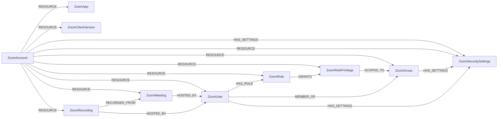

<!-- Generated from the data model. Do not edit manually. -->

## Zoom Schema

### ZoomAccount

A Zoom account containing users and pending invitations.

Ontology Mapping: The Tenant label enables cross-provider tenant queries.

> **Ontology Mapping**: This node uses the ontology label [`Tenant`](#ontology-tenant).

#### Properties

Ontology-generated fields are shown in *italics*.

| Field | Index | Description |
|-------|-------|-------------|
| id | Yes | Zoom account ID used for server-to-server OAuth. |
| firstseen |  | Timestamp when a sync job first created this node. |
| lastupdated | Yes | Timestamp of the last sync that observed this node. |
| *_ont_name* | Yes | Normalized field sourced from `id`. |
| *_ont_source* |  | Module that populated this node's ontology fields. |

#### Relationships

- `(:ZoomAccount)-[:HAS_SETTINGS]->(:ZoomSecuritySettings)`

- `(:ZoomAccount)-[:RESOURCE]->(:ZoomApp)`: The owning Zoom account contains this resource.

- `(:ZoomAccount)-[:RESOURCE]->(:ZoomClientVersion)`: The owning Zoom account contains this resource.

- `(:ZoomAccount)-[:RESOURCE]->(:ZoomGroup)`: The owning Zoom account contains this resource.

- `(:ZoomAccount)-[:RESOURCE]->(:ZoomMeeting)`: The owning Zoom account contains this resource.

- `(:ZoomAccount)-[:RESOURCE]->(:ZoomRecording)`: The owning Zoom account contains this resource.

- `(:ZoomAccount)-[:RESOURCE]->(:ZoomRole)`: The owning Zoom account contains this resource.

- `(:ZoomAccount)-[:RESOURCE]->(:ZoomRolePrivilege)`: The owning Zoom account contains this resource.

- `(:ZoomAccount)-[:RESOURCE]->(:ZoomSecuritySettings)`: The owning Zoom account contains this resource.

- `(:ZoomAccount)-[:RESOURCE]->(:ZoomUser)`: Contains a user or pending invitation in its Zoom account.

### ZoomApp

An account-added or approved Marketplace app. Approval and installation are independent states.

> **Ontology Mapping**: This node has the extra label `ThirdPartyApp` to enable
cross-platform queries for third-party applications.

`_ont_client_id` uses the Marketplace app ID as a surrogate identifier, not
an OAuth client ID. Publication status does not imply enabled state or protocol.

> **Ontology Mapping**: This node uses the ontology label [`ThirdPartyApp`](#ontology-thirdpartyapp).

#### Properties

Ontology-generated fields are shown in *italics*.

| Field | Index | Description |
|-------|-------|-------------|
| id | Yes | Account-scoped Marketplace app ID. |
| firstseen |  | Timestamp when a sync job first created this node. |
| lastupdated | Yes | Timestamp of the last sync that observed this node. |
| account_id | Yes | Owning Zoom account ID. |
| app_id |  | Marketplace app_id. |
| app_scopes |  | Exact OAuth scope identifiers from app_scopes; unknown if omitted, empty if explicitly returned empty. |
| app_status |  | Detail app_status is publication status, not installation state. |
| app_type |  | Detail app_type. |
| approval_required |  | Inverse of approval_info.app_approval_closed, when provided. |
| approval_type |  | approval_info.approved_type, such as forAllUser or forSpecificUser. |
| approved | Yes | Present in the approved_apps list. |
| developer_type |  | List app_developer_type: THIRD_PARTY, ZOOM or INTERNAL; unknown if omitted. |
| installed | Yes | Present in the account_added list; does not enumerate individual user installations. |
| name | Yes | Marketplace app_name. |
| *_ont_client_id* | Yes | Normalized field sourced from `app_id`. |
| *_ont_name* | Yes | Normalized field sourced from `name`. |
| *_ont_source* |  | Module that populated this node's ontology fields. |

#### Relationships

- `(:User)-[:AUTHORIZED]->(:ZoomApp)`: generated by analysis job `Ontology - User AUTHORIZED ThirdPartyApp linking`.
  - Properties:

    | Field | Description |
    |-------|-------------|
    | scopes | Property generated by analysis job: `Ontology - User AUTHORIZED ThirdPartyApp linking`. |

- `(:ZoomAccount)-[:RESOURCE]->(:ZoomApp)`: The owning Zoom account contains this resource.

### ZoomClientVersion

An account-wide Dashboard count of one Zoom client version.

This is an aggregate from the client versions report, not a device or user
inventory, and it cannot be attributed to individual users.

#### Properties

| Field | Index | Description |
|-------|-------|-------------|
| id | Yes | Account-scoped Dashboard client version string. |
| firstseen |  | Timestamp when a sync job first created this node. |
| lastupdated | Yes | Timestamp of the last sync that observed this node. |
| account_id | Yes | Owning Zoom account ID. |
| client_version | Yes | Dashboard client_version, such as a platform-prefixed build string. |
| total_count |  | Dashboard total_count reported for this client version. |

#### Relationships

- `(:ZoomAccount)-[:RESOURCE]->(:ZoomClientVersion)`: The owning Zoom account contains this resource.

### ZoomGroup

A Zoom account group with members correlated from the complete Users API snapshot.

> **Ontology Mapping**: This node has the extra label `UserGroup` to enable
cross-platform queries for user groups.

> **Ontology Mapping**: This node uses the ontology label [`UserGroup`](#ontology-usergroup).

#### Properties

Ontology-generated fields are shown in *italics*.

| Field | Index | Description |
|-------|-------|-------------|
| id | Yes | Account-scoped Zoom group ID. |
| firstseen |  | Timestamp when a sync job first created this node. |
| lastupdated | Yes | Timestamp of the last sync that observed this node. |
| account_id | Yes | Owning Zoom account ID. |
| name | Yes | Group name. |
| total_members |  | Provider total_members. |
| zoom_id |  | Group id. |
| *_ont_name* | Yes | Normalized field sourced from `name`. |
| *_ont_source* |  | Module that populated this node's ontology fields. |

#### Relationships

- `(:ZoomGroup)-[:HAS_SETTINGS]->(:ZoomSecuritySettings)`

- `(:ZoomUser)-[:MEMBER_OF]->(:ZoomGroup)`: MEMBER_OF relationship to ZoomUser.

- `(:ZoomAccount)-[:RESOURCE]->(:ZoomGroup)`: The owning Zoom account contains this resource.

- `(:ZoomRolePrivilege)-[:SCOPED_TO]->(:ZoomGroup)`: SCOPED_TO relationship to ZoomGroup.

### ZoomMeeting

An unexpired scheduled meeting, including a recurring meeting series.

Protection settings describe provider configuration, not verified public access.
Meeting passcodes, join/start URLs, agendas and invitees are never ingested.
Cleanup only runs after every eligible host was read, so a denied read keeps the
prior meetings, and a transfer keeps one HOSTED_BY.

#### Properties

| Field | Index | Description |
|-------|-------|-------------|
| id | Yes | Account-scoped Zoom meeting number. |
| firstseen |  | Timestamp when a sync job first created this node. |
| lastupdated | Yes | Timestamp of the last sync that observed this node. |
| account_id | Yes | Owning Zoom account ID. |
| approval_type |  | Registration: 0 automatic approval, 1 manual approval, 2 not required. |
| authentication_domains |  | Allowed domains from settings.authentication_domains, when returned. |
| auto_recording |  | Configured automatic recording mode from settings.auto_recording. |
| created_at |  | Provider created_at as a native datetime, when available. |
| duration |  | Scheduled duration in minutes. |
| encryption_type |  | Configured encryption mode from settings.encryption_type. |
| host_id | Yes | Provider user ID of the meeting host. |
| join_before_host |  | Whether settings.join_before_host allows participants to join before the host. |
| meeting_authentication |  | Whether settings.meeting_authentication requires authenticated participants. |
| meeting_id |  | Provider meeting ID (meeting number), stored as a string. |
| password_protected |  | Whether the response supplies a nonempty passcode; unknown if omitted. Passcodes are never stored. |
| start_time |  | Scheduled start_time as a native datetime, when available. |
| status |  | Meeting status from the meeting details response. |
| topic |  | Meeting topic from the meeting details response. |
| type |  | Provider meeting type code for instant, scheduled, or recurring meetings. |
| waiting_room |  | Whether settings.waiting_room enables the waiting room. |

#### Relationships

- `(:ZoomMeeting)-[:HOSTED_BY]->(:ZoomUser)`

- `(:ZoomRecording)-[:RECORDED_FROM]->(:ZoomMeeting)`

- `(:ZoomAccount)-[:RESOURCE]->(:ZoomMeeting)`: The owning Zoom account contains this resource.

### ZoomRecording

Cloud recording metadata for one meeting instance within the configured window.

Contains aggregate file metadata and sharing configuration, never recordings,
transcripts, passcodes, or URLs. Links to a scheduled meeting when it is ingested.
Cleanup runs after every eligible host and recording was read, and expires
records outside the rolling lookback window. A denied or unread host skips
cleanup, so the prior recordings are kept.

#### Properties

| Field | Index | Description |
|-------|-------|-------------|
| id | Yes | Account-scoped recorded meeting occurrence UUID. |
| firstseen |  | Timestamp when a sync job first created this node. |
| lastupdated | Yes | Timestamp of the last sync that observed this node. |
| account_id | Yes | Owning Zoom account ID. |
| approval_type |  | Registration: 0 automatic approval, 1 manual approval, 2 not required. |
| authentication_domains |  | Allowed viewer domains from settings.authentication_domains, when returned. |
| auto_delete |  | Whether settings.auto_delete enables automatic deletion. |
| auto_delete_date |  | Provider settings.auto_delete_date, when automatic deletion is configured. |
| duration |  | Recorded meeting duration in minutes. |
| file_types |  | Types of available recording files; file contents and access URLs are never fetched. |
| host_id | Yes | Provider user ID of the recorded meeting host. |
| meeting_id |  | Provider meeting ID (meeting number), stored as a string. |
| meeting_uuid |  | Identifies this recorded meeting instance, including recurring meetings. |
| on_demand |  | Whether viewing requires registration. |
| password_protected |  | Whether settings supplies a nonempty passcode; unknown if omitted. Passcodes are never stored. |
| recording_authentication |  | Whether settings.recording_authentication restricts viewing to authenticated users. |
| recording_count |  | Provider recording_count for this meeting instance. |
| share_recording |  | Provider sharing mode: publicly, internally, or none. Public sharing can still require authentication or a passcode. |
| start_time |  | Recorded meeting start_time as a native datetime, when available. |
| topic |  | Topic of the recorded meeting. |
| total_size |  | Aggregate recording size in bytes. |
| viewer_download |  | Whether settings.viewer_download permits recording downloads. |

#### Relationships

- `(:ZoomRecording)-[:HOSTED_BY]->(:ZoomUser)`

- `(:ZoomRecording)-[:RECORDED_FROM]->(:ZoomMeeting)`

- `(:ZoomAccount)-[:RESOURCE]->(:ZoomRecording)`: The owning Zoom account contains this resource.

### ZoomRole

A common account role and its assigned primary users; privileges are separate nodes.

> **Ontology Mapping**: This node has the extra label `PermissionRole` to enable
cross-platform queries for permission roles.

> **Ontology Mapping**: This node uses the ontology label [`PermissionRole`](#ontology-permissionrole).

#### Properties

Ontology-generated fields are shown in *italics*.

| Field | Index | Description |
|-------|-------|-------------|
| id | Yes | Account-scoped Zoom role ID. |
| firstseen |  | Timestamp when a sync job first created this node. |
| lastupdated | Yes | Timestamp of the last sync that observed this node. |
| account_id | Yes | Owning Zoom account ID. |
| description |  | Role description. |
| name | Yes | Role name. |
| total_members |  | Provider total_members; only primary membership is correlated from the user inventory. |
| zoom_id |  | Role id from the Roles API. |
| *_ont_name* | Yes | Normalized field sourced from `name`. |
| *_ont_scope* | Yes | Property generated by the ontology mapping. |
| *_ont_source* |  | Module that populated this node's ontology fields. |

#### Relationships

- `(:ZoomRole)-[:GRANTS]->(:ZoomRolePrivilege)`: GRANTS relationship to ZoomRole.

- `(:ZoomUser)-[:HAS_ROLE]->(:ZoomRole)`: HAS_ROLE relationship to ZoomUser.

- `(:ZoomAccount)-[:RESOURCE]->(:ZoomRole)`: The owning Zoom account contains this resource.

### ZoomRolePrivilege

One privilege granted by a role, with explicit group restrictions when returned.

#### Properties

| Field | Index | Description |
|-------|-------|-------------|
| id | Yes | Account-scoped role ID and privilege identifier. |
| firstseen |  | Timestamp when a sync job first created this node. |
| lastupdated | Yes | Timestamp of the last sync that observed this node. |
| account_id | Yes | Owning Zoom account ID. |
| group_ids |  | Provider group IDs from privilege_scopes; empty when no group restriction is returned. |
| privilege | Yes | Role privileges entry. |
| restricted_to_groups |  | True when privilege_scopes restricts this privilege to group_ids; false indicates no group restriction returned. |

#### Relationships

- `(:ZoomRole)-[:GRANTS]->(:ZoomRolePrivilege)`: GRANTS relationship to ZoomRole.

- `(:ZoomAccount)-[:RESOURCE]->(:ZoomRolePrivilege)`: The owning Zoom account contains this resource.

- `(:ZoomRolePrivilege)-[:SCOPED_TO]->(:ZoomGroup)`: SCOPED_TO relationship to ZoomGroup.

### ZoomSecuritySettings

Allowlisted security policy metadata from Zoom's settings endpoints.

Configured values and lock flags are separate nodes. A locked flag describes
whether members may change a setting, not whether that setting is enabled.
These are provider-reported settings, not a computed inheritance hierarchy.
Missing values are unknown. Passcodes and raw settings payloads are excluded.
Cleanup runs only when every owner was read, so denied owners keep their prior
settings until a complete sync.

#### Properties

| Field | Index | Description |
|-------|-------|-------------|
| id | Yes | Account-scoped owner and settings-kind identity. |
| firstseen |  | Timestamp when a sync job first created this node. |
| lastupdated | Yes | Timestamp of the last sync that observed this node. |
| account_id | Yes | Owning Zoom account ID. |
| allow_authentication_exception |  | option=meeting_authentication allow_authentication_exception. |
| allow_participants_to_rename |  | in_meeting.allow_participants_to_rename; configured account snapshots only. |
| auto_delete_cloud_recordings |  | recording.auto_delete_cmr; account and user values, account and group lock flags. |
| auto_delete_cloud_recordings_days |  | recording.auto_delete_cmr_days, such as 30, 60, 90 or 120; configured account and user only. |
| auto_security |  | meeting_security.auto_security; require at least one meeting security option. |
| cloud_recording |  | recording.cloud_recording. |
| cloud_recording_download |  | recording.cloud_recording_download. |
| cloud_recording_download_host |  | recording.cloud_recording_download_host; restrict downloads to the host. |
| embed_passcode_in_join_link |  | meeting_security.embed_password_in_join_link. |
| encryption_type |  | meeting_security.encryption_type: enhanced_encryption or e2ee; configured only. |
| end_to_end_encrypted_meetings |  | meeting_security.end_to_end_encrypted_meetings. |
| file_transfer |  | in_meeting.file_transfer. |
| join_before_host |  | schedule_meeting.join_before_host. |
| kind |  | configured contains values; locked contains lock flags, not enabled values. |
| local_recording |  | recording.local_recording. |
| meeting_authentication |  | option=meeting_authentication meeting_authentication, or schedule_meeting.meeting_authentication for locks. |
| meeting_passcode_required |  | meeting_security.meeting_password; stores the policy, never the passcode. |
| only_authenticated_can_join_from_webclient |  | meeting_security.only_authenticated_can_join_from_webclient. |
| phone_passcode_required |  | meeting_security.phone_password; stores the policy, never the passcode. |
| pmi_passcode_required |  | meeting_security.pmi_password boolean policy; never schedule_meeting.pmi_password, which is a secret. |
| private_chat |  | in_meeting.private_chat; allows participants to message each other privately. |
| recording_account_members_only |  | recording.account_user_access_recording. |
| recording_authentication |  | option=recording_authentication recording_authentication, or recording.recording_authentication for locks. |
| recording_embed_passcode_in_link |  | recording.embed_passcode_in_shareable_link. |
| recording_invitees_without_passcode |  | recording.allow_invitees_access_recordings_without_passcode. |
| recording_passcode_required |  | recording.required_password_for_shared_cloud_recordings. |
| recording_sharing |  | recording.allow_share. |
| remote_control |  | in_meeting.remote_control. |
| require_sso_for_domains |  | security.signin_with_sso.require_sso_for_domains; domains are not collected. |
| scope_id |  | Provider ID of the owning account, group, or user. |
| scope_type |  | Owner type: account, group, or user. |
| screen_sharing |  | in_meeting.screen_sharing. |
| sign_again_period_for_inactivity_on_client |  | security.sign_again_period_for_inactivity_on_client; minutes of client inactivity before sign-out, 0 when disabled. Configured account only. |
| sign_again_period_for_inactivity_on_web |  | security.sign_again_period_for_inactivity_on_web; minutes of web inactivity before sign-out, 0 when disabled. Configured account only. |
| sign_in_with_two_factor_auth |  | security.sign_in_with_two_factor_auth: all, group, role, or none; configured only. |
| sign_in_with_work_email |  | security.sign_in_with_work_email. |
| sso_enabled |  | security.signin_with_sso.enable. |
| two_factor_auth_group_ids |  | security.sign_in_with_two_factor_auth_groups; provider group IDs requiring 2FA when sign_in_with_two_factor_auth is group. Configured account only. |
| two_factor_auth_role_ids |  | security.sign_in_with_two_factor_auth_roles; provider role IDs requiring 2FA when sign_in_with_two_factor_auth is role. Configured account only. |
| waiting_room |  | in_meeting.waiting_room for configured snapshots, or meeting_security.waiting_room for locks. |
| waiting_room_scope |  | meeting_security.waiting_room_settings.participants_to_place_in_waiting_room: 0 all participants, 1 users outside the account, 2 users outside the account and allowed domains; configured only. |
| who_can_share_screen |  | in_meeting.who_can_share_screen: host or all; configured only. |

#### Relationships

- `(:ZoomAccount)-[:HAS_SETTINGS]->(:ZoomSecuritySettings)`

- `(:ZoomGroup)-[:HAS_SETTINGS]->(:ZoomSecuritySettings)`

- `(:ZoomUser)-[:HAS_SETTINGS]->(:ZoomSecuritySettings)`

- `(:ZoomAccount)-[:RESOURCE]->(:ZoomSecuritySettings)`: The owning Zoom account contains this resource.

### ZoomUser

A Zoom user account or an invitation awaiting activation.

Ontology Mapping: The UserAccount label enables cross-platform user queries.
Pending invitations are inactive and are replaced by provider-ID nodes on activation.

> **Ontology Mapping**: This node uses the ontology label [`UserAccount`](#ontology-useraccount).

#### Properties

Ontology-generated fields are shown in *italics*.

| Field | Index | Description |
|-------|-------|-------------|
| id | Yes | Account-scoped Zoom ID, or account-scoped normalized email for pending invitations. |
| firstseen |  | Timestamp when a sync job first created this node. |
| lastupdated | Yes | Timestamp of the last sync that observed this node. |
| account_id |  | Zoom account containing this user or invitation. |
| created_at |  | Provider user_created_at as a native datetime, when available. |
| department |  | User's department. |
| display_name |  | User's display name. |
| email | Yes | Trimmed lowercase email used for identity correlation. |
| first_name |  | User's first name. |
| group_ids |  | IDs of groups where the user is a member. |
| last_client_version | Yes | Users API last_client_version; last observed login client, not a complete device inventory. |
| last_login_time | Yes | Provider last_login_time as a native datetime with Zoom's three-day reporting buffer; not precise activity telemetry. |
| last_name |  | User's last name. |
| login_types |  | Provider login method codes; 101 denotes SSO, 100 Zoom work email. |
| plan_type |  | Readable assigned plan type; not purchased seats, billing, or complete product entitlements. |
| role_id |  | Assigned primary account role ID; the optional roles surface links the user to its role and ingests role privileges. |
| status |  | Account membership status: active, inactive, or pending. |
| type |  | Assigned plan type: 1 Basic, 2 Licensed, 4 Unassigned without Meetings Basic, 99 legacy None. |
| zoom_id |  | Provider user ID; absent for pending invitations. |
| *_ont_active* | Yes | Normalized field sourced from `status`. |
| *_ont_email* | Yes | Normalized field sourced from `email`. |
| *_ont_firstname* | Yes | Normalized field sourced from `first_name`. |
| *_ont_fullname* | Yes | Normalized field sourced from `display_name`. |
| *_ont_lastactivity* | Yes | Normalized field sourced from `last_login_time`. |
| *_ont_lastname* | Yes | Normalized field sourced from `last_name`. |
| *_ont_source* |  | Module that populated this node's ontology fields. |

#### Relationships

- `(:User)-[:HAS_ACCOUNT]->(:ZoomUser)`

- `(:ZoomUser)-[:HAS_ROLE]->(:ZoomRole)`: HAS_ROLE relationship to ZoomUser.

- `(:ZoomUser)-[:HAS_SETTINGS]->(:ZoomSecuritySettings)`

- `(:ZoomMeeting)-[:HOSTED_BY]->(:ZoomUser)`

- `(:ZoomRecording)-[:HOSTED_BY]->(:ZoomUser)`

- `(:ZoomUser)-[:MEMBER_OF]->(:ZoomGroup)`: MEMBER_OF relationship to ZoomUser.

- `(:ZoomAccount)-[:RESOURCE]->(:ZoomUser)`: Contains a user or pending invitation in its Zoom account.
